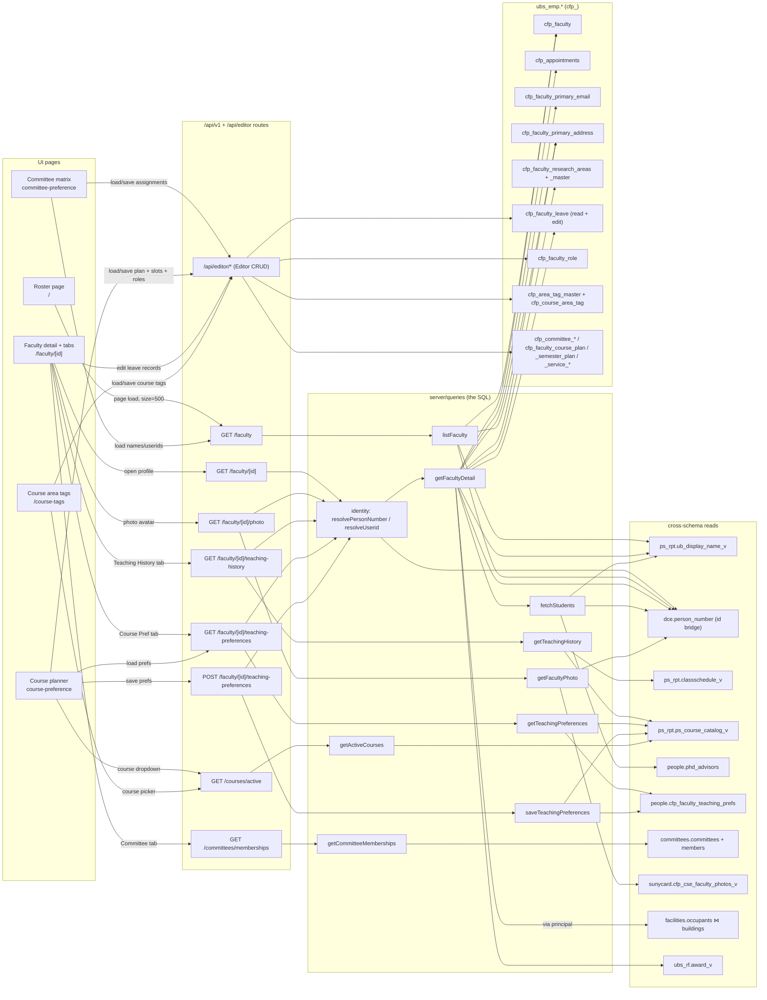
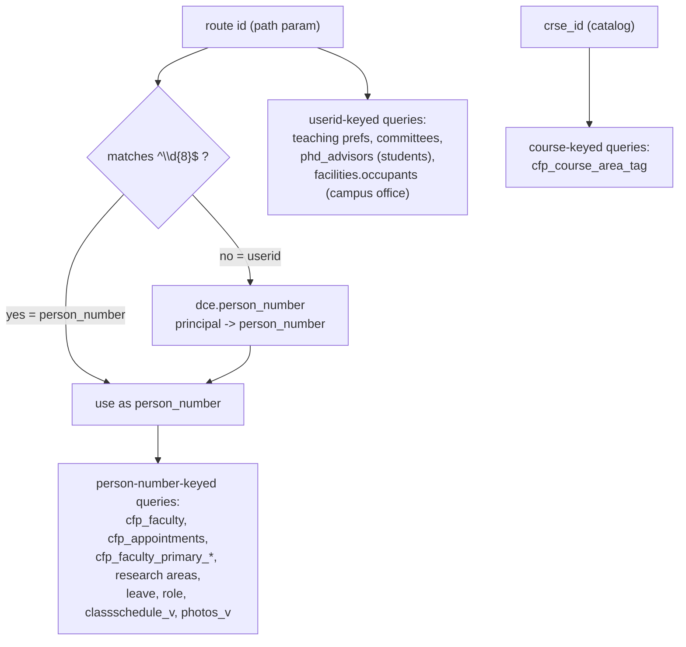

# API → SQL flow (which tables each endpoint touches, and when)

How to use this file:
- It renders automatically on GitHub and in VS Code (Markdown preview with Mermaid).
- To export an image: copy a diagram into <https://mermaid.live> → Actions → PNG/SVG.
- To edit visually: draw.io/diagrams.net → Arrange → Insert → **Mermaid**, paste the code.

Layers: **UI page** → **client service** (fetch only) → **API route** → `getDataSource()` mode switch (db vs mock) → **query module** (the SQL) → **tables** (grouped by schema). Edge labels = the scenario/trigger.

Reflects the current code after the Tier-1 query trim (no `cfp_appointments`/`cfp_faculty_primary_email` on the roster; no phone/teaching-reductions on detail) and the editable-surface additions (per-year faculty roles, leave CRUD, and course area tags on the new `/course-tags` page).

Table/column facts below are grounded in the committed live-DB schema export ([`scripts/db-schema/data/`](../scripts/db-schema/data/), snapshot `2026-06-14`). See [sql-reference.md](sql-reference.md) for the SQL itself and the export's coverage caveats (no composite UNIQUEs / CHECKs).

---

## 1. Master flow — every read/write path

---

## 2. The identity bridge (why some queries key on person_number, others on userid)

`dce.person_number` maps an 8-digit **person_number** ↔ **principal (userid)**. Every
`/faculty/[id]/*` route accepts either id and resolves first.

---

## 3. Per-API cheat sheet (scenario → tables)

| API endpoint | Triggered when | Tables touched |
| --- | --- | --- |
| `GET /faculty` | Roster page load; committee-matrix load | `cfp_faculty`, `ub_display_name_v`, `dce.person_number`, `cfp_faculty_primary_address` |
| `GET /faculty/[id]` | Opening a faculty profile | `cfp_faculty`, `ub_display_name_v`, `dce.person_number`, `cfp_appointments`, `cfp_faculty_primary_email`, `cfp_faculty_primary_address`, `cfp_faculty_research_areas`(+master), `cfp_faculty_leave`, `ubs_rf.award_v` (awards), `facilities.occupants ⋈ buildings` (campus office, via principal), `people.phd_advisors` (students) |
| `GET /faculty/[id]/photo` | Detail summary card (`FacultyPhoto` in `FacultySummaryCard`) | `sunycard.cfp_cse_faculty_photos_v` (binary stream, 404 → initials) |
| `GET /faculty/[id]/teaching-history` | Teaching History tab | `ps_rpt.classschedule_v` ⋈ `ps_rpt.ps_course_catalog_v` |
| `GET /faculty/[id]/teaching-preferences` | Course-Pref tab / planner load | `people.cfp_faculty_teaching_prefs` ⋈ `ps_course_catalog_v` |
| `POST /faculty/[id]/teaching-preferences` | Saving course preferences | `people.cfp_faculty_teaching_prefs` (DELETE/UPDATE/INSERT) + catalog lookup |
| `GET /committees/memberships` | Committee tab | `committees.committees` ⋈ `committees.members` |
| `GET /courses/active` | Course dropdown + preference grid (planner); course picker (`/course-tags`) | `ps_course_catalog_v` (latest active per crse_id) |
| `/api/editor/*` (10 routes) | Committee-matrix, course-planner, leave, role & area-tag edits | `cfp_committee_catalog`, `cfp_committee_assignment`, `cfp_committee_service_summary`, `cfp_faculty_course_plan`, `cfp_faculty_semester_plan`, `cfp_faculty_role`, `cfp_faculty_leave`, `cfp_area_tag_master`, `cfp_course_area_tag`, `cfp_service_categories` |

> Mock mode: every read path above has a no-SQL twin in `server/mocks` selected by
> `FACULTY_DATA_MODE`; the diagram shows the **db** branch.

---

## 4. Key columns per table (from the live schema export)

Join/filter keys and the charset each table lives in (drives the `CONVERT(… USING utf8mb4)` on cross-charset joins). Full column lists: [`scripts/db-schema/data/by-database/`](../scripts/db-schema/data/by-database/).

| Table | Charset | PK | Join / filter key(s) used by the app |
| --- | --- | --- | --- |
| `ubs_emp.cfp_faculty` | utf8mb4 | `person_number` | anchor; `cv_document_id → cfp_documents` |
| `ubs_emp.cfp_appointments` | utf8mb4 | `person_number` | 1:1 on `person_number` |
| `ubs_emp.cfp_faculty_primary_email` / `_address` | utf8mb4 | `person_number` | 1:1 on `person_number` |
| `ubs_emp.cfp_faculty_research_areas` | utf8mb4 | `faculty_research_area_id` | `person_number`; `research_area_id → cfp_research_area_master` |
| `ubs_emp.cfp_faculty_leave` | utf8mb4 | `leave_id` | `person_number` (read + edit; `leave_type` ∈ `LEAVE_TYPES`) |
| `ubs_emp.cfp_faculty_role` | utf8mb4 | `role_id` | UNIQUE `(person_number, academic_year, role)`; `role` ∈ `ALL_ROLES` |
| `ubs_emp.cfp_area_tag_master` | utf8mb4 | `tag_id` | UNIQUE `name` (AI/Systems/PL/Theory/Special Topics) |
| `ubs_emp.cfp_course_area_tag` | utf8mb4 | `course_area_tag_id` | UNIQUE `(crse_id, tag_id)`; FK `tag_id → cfp_area_tag_master` (CASCADE) |
| `ubs_emp.cfp_committee_assignment` | utf8mb4 | `assignment_id` | FK `catalog_id → cfp_committee_catalog`; `userid`, `academic_year` |
| `ubs_emp.cfp_faculty_semester_plan` | utf8mb4 | `semester_plan_id` | FK `course_plan_id → cfp_faculty_course_plan` (CASCADE) |
| `dce.person_number` | latin1 | `(person_number, principal)` | id bridge: `person_number ↔ principal` |
| `ps_rpt.ub_display_name_v` | latin1 | `emplid` | `emplid = person_number` → `name_display` |
| `ps_rpt.classschedule_v` | latin1 | `(courseid, classnumber, termsourcekey)` | `facultysourcekey = person_number`; `courseid → catalog` |
| `ps_rpt.ps_course_catalog_v` | latin1 | `crse_id` | `crse_id`; rank by `effectivedate`/`effectivestatus='A'` |
| `people.cfp_faculty_teaching_prefs` | utf8 | `id` | upsert key `(userid, crse_id, term_code)` |
| `people.phd_advisors` | latin1 | `id` | `advisor = userid AND active = 1` |
| `committees.committees` | latin1/utf8 | `id` | `name` UNIQUE |
| `committees.members` | utf8 | `id` | FK `committee_id → committees.id`; `userid` |
| `sunycard.cfp_cse_faculty_photos_v` | utf8mb4 | `person_number` | `person_number` / `principal` → `image` (mediumblob) |
| `facilities.occupants` | latin1 | `id` | `userid = principal`; `bldabr → buildings` → campus office |
| `facilities.buildings` | latin1 | `building` | `building_abbr = occupants.bldabr` → `building_name` |
| `ubs_rf.award_v` | utf8mb4 | `award_number` | `person_number` → awards (`award_number`, `title`, `award_start`) |

> Only four FKs are declared DB-side (`committees.members → committees`, `cfp_committee_assignment → cfp_committee_catalog`, `cfp_faculty_semester_plan → cfp_faculty_course_plan`, `cfp_course_area_tag → cfp_area_tag_master`); everything else is a join convention.
>
> **In the ER model but not in any flow** (no endpoint queries them): `ps_rpt.ps_class_capacity_v` (no enrollment-capacity feature) and `cfp_faculty_primary_phone_number` / `cfp_teaching_reductions` (fetched-but-never-rendered, since removed). They exist in the schema export but are intentionally untouched by the app.
