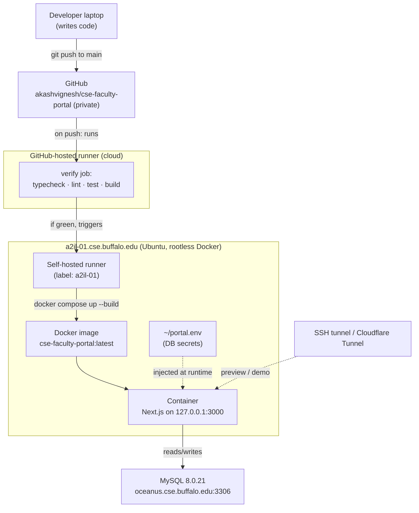

# Deployment & Operations Guide

> A complete, first-time-reader walkthrough of how the **CSE Faculty Portal** is
> built, hosted, and shipped — what we used, why, and how to operate it day to
> day. If you've never seen this project before, start here.
>
> For the application's internals (every SQL query, API → table map) see
> [sql-reference.md](sql-reference.md) and [api-sql-flowchart.md](api-sql-flowchart.md).

---

## Table of contents

1. [What this project is](#1-what-this-project-is)
2. [Technology stack (and why each piece)](#2-technology-stack-and-why-each-piece)
3. [The big picture (architecture diagram)](#3-the-big-picture)
4. [The server it runs on](#4-the-server-it-runs-on)
5. [Rootless Docker — the key enabler](#5-rootless-docker--the-key-enabler)
6. [Secrets: `portal.env`](#6-secrets-portalenv)
7. [The Docker setup (3 files explained)](#7-the-docker-setup)
8. [CI/CD: push-to-deploy with GitHub Actions](#8-cicd-push-to-deploy)
9. [How a deploy actually happens (step by step)](#9-how-a-deploy-actually-happens)
10. [Operating the deployment (everyday commands)](#10-operating-the-deployment)
11. [How to view / access the app](#11-how-to-view--access-the-app)
12. [Security posture & hard constraints](#12-security-posture--hard-constraints)
13. [Troubleshooting](#13-troubleshooting)
14. [Glossary (jargon decoded)](#14-glossary)
15. [Roadmap / what's still TODO](#15-roadmap)

---

## 1. What this project is

The **CSE Faculty Portal** is an internal web application for the University at
Buffalo Department of Computer Science & Engineering. It shows a faculty roster
and per-faculty detail (appointments, contact, research areas, leave, teaching
history, committee service, course preferences), and lets staff edit the
editable bits (committee assignments, course plans, teaching preferences).

- It's a **Next.js** app (React front end + server-side API routes in one
  codebase).
- All database access is **server-side only** — the browser only ever fetches
  JSON; it never talks to the database directly.
- It can run in two modes via the `FACULTY_DATA_MODE` env var:
  - `local` — bundled **mock data**, fully offline, **no database needed**
    (used for development and for the CI build).
  - `db` — the **live university MySQL** database (used in the real deployment).

---

## 2. Technology stack (and why each piece)

| Layer | Tool | Why it's here |
| --- | --- | --- |
| Framework | **Next.js 15** (App Router) | React UI + API routes in one deployable app |
| UI | **React 19** | Component model for the pages/tables |
| Tables/editing | **DataTables + DataTables Editor (server)** | Generates the CRUD SQL for the editable `cfp_*` tables |
| DB access | **knex** (query builder) + **mysql2** (driver) | Server-side SQL to MySQL |
| Validation | **zod** | Validates environment config and request payloads |
| Language | **TypeScript** | Type safety across the codebase |
| Tests | **Vitest** + Testing Library | Unit/component tests run in CI |
| Lint/format | **ESLint** + **Prettier** | Code quality gates in CI |
| Packaging | **Docker** (multi-stage) | Reproducible build → one runnable image |
| Orchestration | **Docker Compose** | Declares the service, ports, env, restart policy |
| CI/CD | **GitHub Actions** + a **self-hosted runner** | Verify on every change; auto-deploy on `main` |
| Host | **Ubuntu 24.04** server (`a2il-01`) | Where the container runs |
| Database | **MySQL 8.0.21** (`oceanus`) | The live university data |
| Preview/sharing | **SSH tunnel** / **Cloudflare Tunnel** | View privately, or share a temporary public demo URL |

---

## 3. The big picture



**One-line summary:** push code to `main` → GitHub verifies it in the cloud →
the server's own runner builds a Docker image and (re)starts the container →
the container serves the app and talks to the live MySQL database.

---

## 4. The server it runs on

| Property | Value |
| --- | --- |
| Host | `a2il-01.cse.buffalo.edu` |
| OS | Ubuntu 24.04.4 LTS (x86_64) |
| Public IP | `128.205.35.203` (UB network) |
| CPU / RAM | 16 cores / 62 GB |
| Disk | `/` = 25 GB (small!), `/home` = **1.4 TB** (where Docker data lives) |
| Login user | `asureshk` (group `easgrad`) |
| **Sudo?** | **No** — this is a managed CSE machine; we have no root |

The "no sudo" fact shaped every decision below. We can't install system
services, start the normal Docker daemon, bind privileged ports (80/443), or
change the firewall. Everything had to work **as an unprivileged user**.

CSE IT (contact: **Ed**) enabled **rootless Docker** for our accounts, which is
what made a containerized deploy possible without root.

---

## 5. Rootless Docker — the key enabler

Normal ("rootful") Docker runs a system daemon as root. We don't have root, so
instead we use **rootless Docker**: a Docker daemon that runs entirely inside
our own user account.

What that means in practice:

- The Docker socket is **not** at the default `/var/run/docker.sock`. It's at
  `unix:///run/user/<your-uid>/docker.sock`. The CLI finds it via the
  `DOCKER_HOST` environment variable (set in `~/.bashrc` and in the runner's
  service file).
- **Images and data live in `~/.local/share/docker`** — on the 1.4 TB `/home`,
  not the tiny 25 GB `/`. (Solved a disk-space worry for free.)
- **Networking** uses a userspace stack (`slirp4netns`). You'll see a warning
  `IPv4 forwarding is disabled. Networking will not work.` — **ignore it**; it's
  cosmetic for rootless. We verified containers reach the database fine.
- **Privileged ports (<1024) can't be bound** without root, so the app uses
  port **3000** (not 80/443).

### Keeping it alive after logout — "linger"

By default, a user's background services stop the moment you log out of SSH.
We enabled **linger** so the rootless Docker daemon, the runner, and the app
container keep running across logouts and reboots:

```bash
loginctl enable-linger $USER          # -> Linger=yes
systemctl --user enable docker        # rootless docker starts at boot
```

### One-time rootless setup (already done)

```bash
dockerd-rootless-setuptool.sh install
systemctl --user start docker
systemctl --user enable docker
echo 'export DOCKER_HOST=unix:///run/user/$(id -u)/docker.sock' >> ~/.bashrc
```

---

## 6. Secrets: `portal.env`

Database credentials are **never** stored in git or baked into the Docker
image. They live in a single file on the server, readable only by us:

```bash
# ~/portal.env  (chmod 600)
DB_USER=<db username>
DB_PASSWORD=<db password>
DEV_USERID=<userid stamped into audit columns>
```

This file is **sourced** into the shell right before `docker compose up`, and
Compose injects the values into the container as environment variables. It is
excluded from the image by `.dockerignore` and from git by `.gitignore`.

Non-secret config (which database, which host, which mode) is **not** here —
it's inlined in `docker-compose.yml`.

---

## 7. The Docker setup

Three files in the repo root define how the app is packaged and run.

### `Dockerfile` — how the image is built

A **multi-stage** build (smaller, cleaner final image):

1. **deps** — `npm ci` installs all dependencies (incl. dev) for building.
2. **builder** — runs `npm run build` in `FACULTY_DATA_MODE=local` (the build
   needs no database).
3. **prod-deps** — `npm ci --omit=dev` produces a slimmer runtime
   `node_modules`.
4. **runner** — the final image: Node 22 on Alpine, runs as the non-root `node`
   user, serves with `next start` on port 3000.

Two deliberate choices worth knowing:

- We ship the **full production `node_modules`** (not Next's "standalone"
  output) because `knex` loads the `mysql2` driver via a *dynamic* require that
  standalone file-tracing can miss. Shipping the real modules guarantees the DB
  driver is present at runtime.
- The runtime stage runs `apk upgrade` to patch base-OS packages (clears a
  flagged base-image CVE) and `--chown`s `.next` so the non-root user can write
  its runtime cache.

### `docker-compose.yml` — how the image is run

```yaml
services:
  app:
    build: { context: . }
    image: cse-faculty-portal:latest
    container_name: cse-faculty-portal
    restart: unless-stopped                 # auto-restarts after crashes/reboots
    ports:
      - "127.0.0.1:3000:3000"               # localhost-only (see §12)
    environment:
      FACULTY_DATA_MODE: db
      DB_HOST: oceanus.cse.buffalo.edu       # FQDN so the container can resolve it
      DB_PORT: "3306"
      DB_DATABASE: ubs_emp
      DB_USER: ${DB_USER:?...}               # from portal.env
      DB_PASSWORD: ${DB_PASSWORD:?...}       # from portal.env
      DEV_USERID: ${DEV_USERID:-system}
```

### `.dockerignore` — what stays out of the image

Excludes `node_modules`, `.next`, `.git`, the schema-dump CSVs, and — crucially
— **all `.env`/secret files**, so credentials never end up in an image layer.

---

## 8. CI/CD: push-to-deploy

Defined in [`.github/workflows/ci.yml`](../.github/workflows/ci.yml). Two jobs:

### `verify` (runs in GitHub's cloud, on every push + PR)
```
npm ci → typecheck → lint → test → build (FACULTY_DATA_MODE=local)
```
This catches broken code **before** anything is deployed. It uses GitHub-hosted
minutes; no database involved.

### `deploy` (runs on the server's self-hosted runner, only on green push to `main`)
```yaml
needs: verify
if: github.event_name == 'push' && github.ref == 'refs/heads/main'
runs-on: [self-hosted, a2il-01]
```
Its single step:
```bash
export DOCKER_HOST="unix:///run/user/$(id -u)/docker.sock"
set -a; source "$HOME/portal.env"; set +a
docker compose up -d --build       # build image + (re)start container
docker image prune -f              # clean up old layers
# readiness check: poll :3000 for ~60s; fail the deploy if the app never answers
```

### The self-hosted runner

Because the server sits behind a campus firewall (no inbound), GitHub's cloud
can't reach it — so the server runs a **self-hosted runner** that dials *out* to
GitHub and waits for jobs. It was registered with the label **`a2il-01`** (which
the `deploy` job targets) and runs as a **user systemd service** so it survives
logout/reboot:

```
~/.config/systemd/user/actions-runner.service   # ExecStart = run.sh, Restart=always
```

> No container registry is used — the same machine builds and runs the image, so
> the image never needs to be pushed anywhere. The runner checks out the private
> repo automatically using the workflow's built-in `GITHUB_TOKEN`.

---

## 9. How a deploy actually happens

1. You `git push` to `main` (or merge a PR into `main`).
2. GitHub starts the workflow. **`verify`** runs in the cloud
   (typecheck/lint/test/build).
3. If `verify` is green, **`deploy`** is dispatched to the **`a2il-01`** runner.
4. The runner checks out the code, sources `~/portal.env`, and runs
   `docker compose up -d --build`.
5. Docker builds a fresh image and (re)starts the `cse-faculty-portal`
   container on `127.0.0.1:3000`.
6. The readiness check curls `:3000`; if the app answers, the deploy is green.
   If not, it prints container logs and **fails** (so a broken deploy is loud).
7. The container keeps running (`restart: unless-stopped` + linger), serving the
   app and talking to MySQL at `oceanus`.

---

## 10. Operating the deployment

All commands run on the server as `asureshk` (with `DOCKER_HOST` set — it's in
`~/.bashrc`).

| Task | Command |
| --- | --- |
| See running container | `docker ps` |
| App logs (live) | `docker logs -f cse-faculty-portal` |
| Restart the app | `docker restart cse-faculty-portal` |
| Stop the app | `docker stop cse-faculty-portal` |
| Manual rebuild + redeploy | `cd <repo> && set -a; source ~/portal.env; set +a; docker compose up -d --build` |
| Runner status | `systemctl --user status actions-runner` |
| Runner logs | `journalctl --user -u actions-runner -f` |
| Rootless docker status | `systemctl --user status docker` |
| Quick health check | `curl -sS http://localhost:3000 \| head` |
| DB-layer check (real test) | `curl -sS "http://localhost:3000/api/v1/faculty?size=5"` |

**To ship a change:** commit → push to `main`. That's it; the pipeline does the
rest. No manual server steps needed for a normal deploy.

---

## 11. How to view / access the app

The app is bound to **`127.0.0.1:3000` on the server** (localhost-only), so it is
**not** directly reachable from other machines. Three ways to view it:

### a) From the server itself
```bash
curl -sS http://localhost:3000 | head
```

### b) From your own PC — SSH tunnel (private, recommended)
Run on your PC and keep the window open:
```bash
ssh -L 3000:localhost:3000 asureshk@a2il-01.cse.buffalo.edu
# then open http://localhost:3000 in your browser
```
This forwards your PC's port 3000 to the server's app, securely. Only you see
it. (Use `-L 8080:localhost:3000` if your local 3000 is busy.)

### c) Temporary public URL — Cloudflare Tunnel (for a demo)
```bash
# one binary, runs as your user, no root, works through the firewall (outbound)
~/cloudflared tunnel --url http://localhost:3000
```
Prints a random `https://<words>.trycloudflare.com` URL anyone can open. It
lives only while that command runs (Ctrl+C to stop). **The URL is public — see
the warning in §12 before sharing it.**

---

## 12. Security posture & hard constraints

> **Read this before exposing the app to anyone.**

- 🔴 **No authentication yet.** `getCurrentUser()` (`src/lib/auth.ts`) returns a
  fixed `DEV_USERID`; there is no login. Every write is stamped to that one
  userid, and **anyone who can reach the app can read *and edit/delete* faculty
  data.** Until real SSO/Shibboleth is added, the app must **not** be openly
  public.
- 🟠 **That's why it's bound to `127.0.0.1:3000`** — not the public network.
  Preview it via the SSH tunnel; only use the Cloudflare tunnel for a
  *controlled, temporary* demo and shut it down afterward. Do **not** run the
  quick tunnel as an always-on service.
- 🟡 **Rootless limits:** no ports below 1024 (so no 80/443 / nginx without
  root), no system-level services. TLS + a clean public URL will require CSE IT.
- 🟡 **Firewall:** inbound access to the box is controlled by the campus edge
  firewall (not by us), so "make it public" is also an IT decision.
- 🟢 **Secrets are handled correctly:** DB creds live only in `~/portal.env`
  (chmod 600), excluded from both git and the Docker image.

### Path to safe public hosting (in order)
1. Add **authentication** (UB SSO/Shibboleth) — replace the `getCurrentUser()`
   stub; add `middleware.ts` to gate routes.
2. Ask **CSE IT** to allow inbound and ideally restrict to campus/VPN.
3. Put **nginx + TLS** in front (needs root → IT) for `https://…`.
4. Switch compose from `127.0.0.1:3000` to `0.0.0.0` behind that proxy.

---

## 13. Troubleshooting

| Symptom | Likely cause / fix |
| --- | --- |
| `Cannot connect to the Docker daemon` | `DOCKER_HOST` not set, or rootless docker stopped → `systemctl --user start docker`; ensure the env var is exported |
| Deploy job stuck "Queued" forever | Runner offline or missing the `a2il-01` label → check `systemctl --user status actions-runner`; re-register with `--labels a2il-01` |
| Deploy fails at the readiness check | App didn't answer on `:3000` → `docker compose logs --tail=60`; usually a DB auth/connection error (check `~/portal.env`) |
| App loads but roster is empty | Often **not a bug** — the `cfp_faculty`/identity tables may be unpopulated. Confirm with `curl …/api/v1/faculty` returning `ok` + `[]` |
| `IPv4 forwarding is disabled` warning | Cosmetic in rootless mode — ignore |
| Everything dies after you log out | `linger` not enabled → `loginctl enable-linger $USER` (needs `Linger=yes`) |
| Container gone after reboot | Ensure `restart: unless-stopped` (it is) **and** linger + `systemctl --user enable docker` |

---

## 14. Glossary

- **Rootless Docker** — Docker running entirely inside a normal user account, no
  root required.
- **`DOCKER_HOST`** — env var telling the docker CLI where the daemon socket is
  (for rootless: `/run/user/<uid>/docker.sock`).
- **Linger** — a systemd feature that keeps a user's services running after they
  log out (and starts them at boot).
- **Self-hosted runner** — a GitHub Actions worker you install on your own
  machine; it dials out to GitHub and runs your workflow jobs locally.
- **Multi-stage Docker build** — a Dockerfile with several `FROM` stages; only
  the last one ships, keeping the final image small.
- **Docker Compose** — a YAML file + CLI that defines and runs a container
  (ports, env, restart policy) with one command.
- **`FACULTY_DATA_MODE`** — `local` (mock data, no DB) vs `db` (live MySQL).
- **SSH tunnel (`-L`)** — forwards a port on your PC to a port on the server over
  the SSH connection, for private access.
- **Cloudflare Tunnel** — an outbound-only connector that exposes a local
  service at a public URL without opening firewall ports.

---

## 15. Roadmap

Things known to be incomplete or deferred:

1. **Authentication** — the #1 item. No login exists; required before any public
   exposure. (`middleware.ts` + a real `getCurrentUser()`.)
2. **Public access** — needs auth + CSE IT (firewall) + nginx/TLS (root).
3. **Data loading** — several source tables can be empty on the dev DB, leaving
   the roster blank until populated.
4. **Stable public URL** — the demo uses an ephemeral `trycloudflare.com` URL; a
   permanent one needs a named Cloudflare tunnel + account/domain (or nginx).
5. **Observability** — no structured logging / health dashboard yet (there's an
   ad-hoc readiness check in the deploy job).

---

### Quick reference

| Thing | Value |
| --- | --- |
| Server | `a2il-01.cse.buffalo.edu` (Ubuntu 24.04, rootless Docker, no sudo) |
| Deploy repo | `github.com/akashvignesh/cse-faculty-portal` (private) |
| Database | `oceanus.cse.buffalo.edu:3306` (MySQL 8.0.21, schema `ubs_emp`) |
| App port | `127.0.0.1:3000` (localhost-only) |
| Runner label | `a2il-01` (systemd `--user` service) |
| Secrets file | `~/portal.env` (chmod 600) |
| Deploy trigger | push/merge to `main` |
